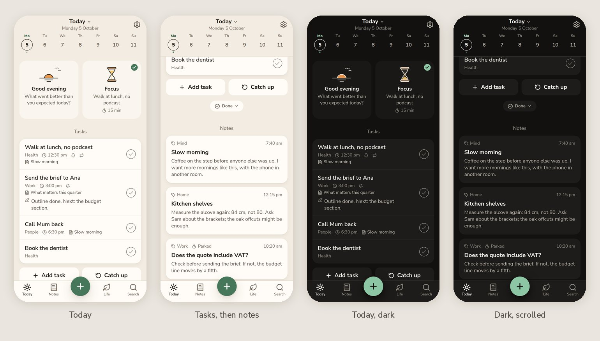
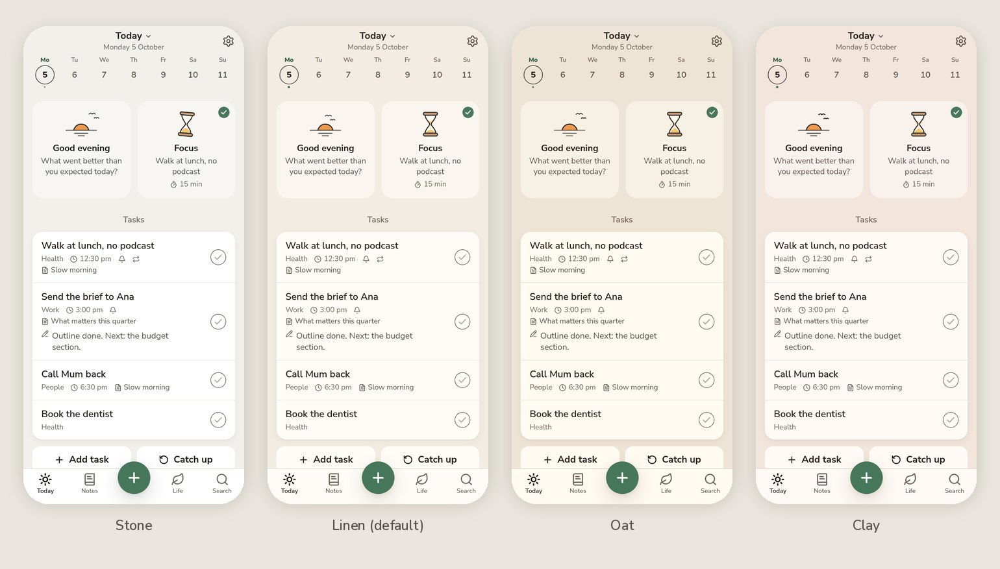
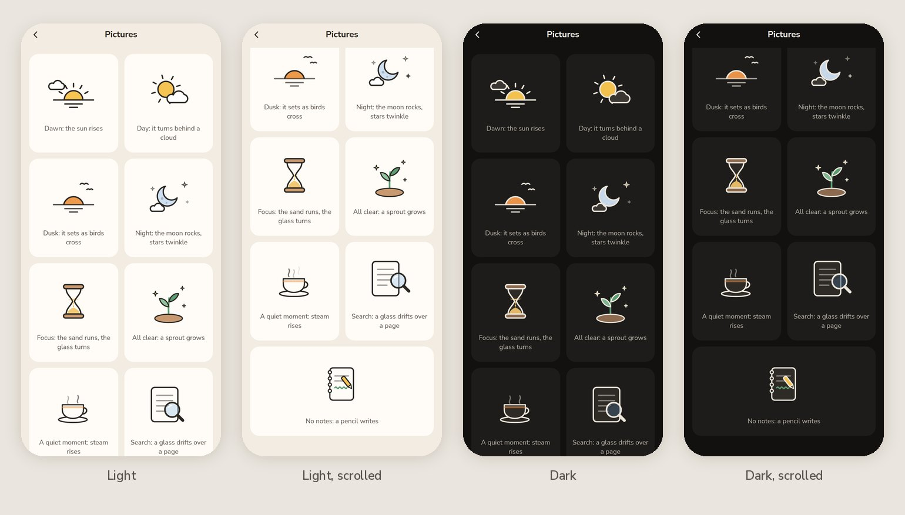
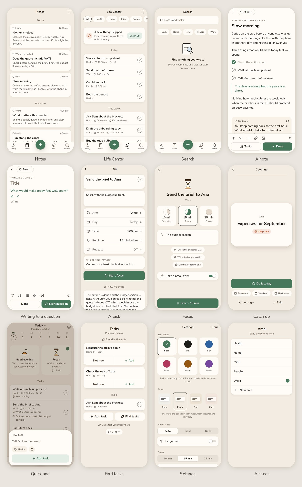
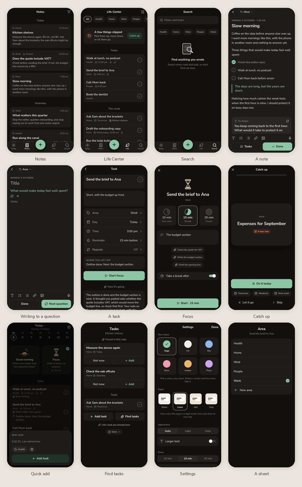
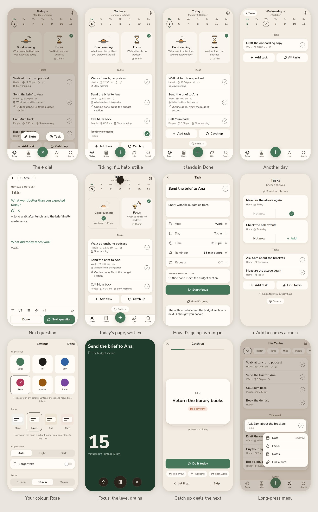

# Clarity revamp 5: "Sage"

A redesign of Clarity guided by **Rosebud** (the AI journal), taken as a design language rather than a feature list. It's a separate Expo Go prototype with sample data and no backend, built on revamp 4's code (features, store and motion) and redrawn.

- **Open it on your phone:** in Expo Go, scan `docs/expo-go-qr.png` or enter `exp://cassette-excuse-legs-sake.trycloudflare.com`. The address changes whenever the tunnel restarts.
- **Where it lives:** `/root/projects/clarity-revamp-5`. It isn't in git and nothing has been ported into the app.
- **The one-page version** of this document, with live specimens, is `docs/design.html`. Rebuild it with `node docs/build-presentation.mjs`.

## After the first look on a phone (2026-10-05)

Four notes from the user, and what changed:

1. **"The top (above Today) feels off."** The month title, the week and a separate "Today Monday 5 October" line said the same thing three times, with loose spacing and large numbers; in dark mode the chosen day's disc nearly vanished. Now the top is one compact head: "**Today** ⌄" with "Monday 5 October" small under it (tap it for the calendar), then a quieter week with smaller numbers and a thin ink ring around the chosen day. The separate heading line is gone, and the content starts about 60 points higher.
2. **"In light mode tasks don't feel emphasised enough."** Task titles are now SemiBold. Task cards are the brightest surface, with a warm, slightly deeper lift. Today's two cards step back: they're shorter, sit on a quieter tint, and have no lift, so the tasks lead the page.
3. **"The area colours overwhelm the design."** Areas have no colour anywhere now. An area is a grey word in a task's line, a small tag on a note, and a plain chip in the filters. The only colours left are your accent and terracotta for late things.
4. **"Explore warmer tones for light mode."** There's a new **Paper** setting with four light pages: Stone (the first, cooler grey), **Linen** (the new default, a warm cream), Oat (a deeper beige) and Clay (rosy). Each has its own warm white for cards and inks tinted to match, and every text colour still reads at 4.5:1 or better. Switch between them in Settings to compare on the phone.

## The brief

The user asked for:

- a redesign of Clarity with Rosebud as the main guide;
- simplicity and delight in interactions;
- no unnecessary counts (of notes, tasks and so on);
- an interface that is readable yet warm;
- modern micro-interactions and animations, made from scratch where needed;
- icons instead of text where they ease the load;
- a separate Expo Go app called revamp-5, with the main app untouched.

Two answers to questions on 2026-10-05 settled the direction:

- **Copy the design elements and structure adapted to Clarity**, not Rosebud's full structure or specific elements. Clarity keeps its own features: notes, tasks, focus, Catch up and Life Center.
- **Sage is the accent, with a picker**, as Rosebud lets people choose their colour.

## What Rosebud does well

All 47 of Rosebud's screens and its two-minute onboarding video were studied on Appllama (references: `clarity-design-research/revamp-5/rosebud/refs.md`). What makes it work:

1. **A grey page with white cards.** Content sits on cards; everything else (headings, the week, controls) sits quietly on the page. Nothing has a border.
2. **Small, calm type in one family.** Titles are bold, never big. Section names are small, grey, centred and in sentence case.
3. **One accent, chosen by the person.** The accent is spent on the primary button, the + button, ticked checks and toggles. Disabled buttons are a pale tint of the accent, not grey.
4. **Structure, repeated.** Each screen is a centred title, then cards, then a pair of equal buttons under a card, then the next centred heading.
5. **Things change in place.** "Add goal" turns into a check, "Finish entry" splits into "Back / Confirm", and Confirm becomes a spinner. A reflection arrives after three dots and writes itself in.
6. **Small flat pictures, only at moments.** A sun, a moon, a sprout and a party popper, drawn as flat colour inside a dark outline, appear at the start of the day and the end of a flow, never as decoration.

## How it maps onto Clarity

| Rosebud | Clarity, revamp 5 |
|---|---|
| Grey page, white cards | Warm grey page `#F2F0EB`; tasks, notes and settings on white cards |
| Month over a week strip; "Today July 23" | One compact head: "**Today** ⌄" over "Monday 5 October", then the week. The name opens the calendar. |
| Morning Intention and Evening Reflection cards | **Today's two ways in:** writing to the day's question and focusing on what's next, each with its own small moving picture |
| A card with checks on the right | Tasks on a card, Rosebud's check under the thumb |
| Add goal / Manage under the list | **Add task / Catch up** (or All tasks) |
| Completed goals, filled checks | A folded **Done** under the tasks; it gives a small bump when a task lands in it |
| History of entry cards | **Notes**: a card per note under centred day headings |
| The composer's chip, question and buttons | **The note page**: area chip, small-capital date, the question in the accent, then Done and **Next question** |
| Entry reflection | **How it's going** on a task: three dots, then the summary writes itself in word by word |
| Goal suggestions, "+ Add goal" turning into a check | **Find tasks**: a card per task found in a note, with **Not now / + Add**; Add turns into a check |
| Edit goal: field, "why", one settings card | **Task page**: the task in a white field with its check, the details, one card of Area / Day / Time / Reminder / Repeats |
| Choose your theme, six tiles | **Your colour** in Settings: Sage, Ink, Sky, Rose, Amber, Plum |
| Settings sheet with Done | Settings is a sheet with Done, grey captions and white groups |
| Five places, round + in the middle | **Today, Notes, +, Life, Search**. The + opens a small dial with **Note** and **Task**. |
| "First entry complete!" | **All caught up**: a sprout grows, then one button |
| Finish entry's in-place confirm | **Delete task** and **Reset sample data** ask in place: the button splits into Keep and Delete |

**Not taken:** the morning and evening rituals themselves, goals, weekly series, streaks and the streak calendar, insights built on word and entry counts, coachmarks, the paywall, onboarding questions, and emoji as icons.

**Added for Clarity:** a Search tab gives the bar its fourth place and gathers notes and tasks in one search; search used to live inside Notes.

## Principles

1. **Content on cards, chrome on the page.** If you wrote it, it sits on a white card. Headings, the week and the controls stay on the page. The day's tasks are the brightest card on Today.
2. **Quiet centred names, no counts.** Sections label what follows and never count it, and nothing measures your notes, tasks or words. Progress is a line that fills; Catch up shows one card peeking from behind, never a number.
3. **One accent, yours, and no other colour.** Sage unless you pick another. It goes on the primary action, a ticked check, the +, toggles and focus time. Areas are words, not colours.
4. **Buttons answer in place.** A label rolls to the next one; a spinner or a check grows where the words were; a confirmation splits a button in two. No alert asks "are you sure?" about small things.
5. **An icon before a word.** The bar, the task meta line, the note tools and the time-of-day setting are icons. Words stay where an icon could be misread.
6. **Pictures for moments.** Six small hand-drawn scenes appear where a moment deserves one (the day's question, focus, a clear list, an empty search), and each has one quiet motion.

## Colour

A warm page, warm white cards, warm ink, and one accent. Every text colour reads at 4.5:1 or better on page, card and well in both themes (checked with `/tmp/clarity-revamp-5/contrast.py`).

**Paper** (light mode, chosen in Settings):

| Paper | page | card | quiet (Today's cards) | ink / ink2 / ink3 |
|---|---|---|---|---|
| Stone | `#F2F0EB` | `#FFFFFF` | `#F8F6F2` | `#1F1D1A` / `#57524B` / `#6F6A62` |
| **Linen** (default) | `#F3ECE2` | `#FFFCF7` | `#FAF5EE` | `#2A231C` / `#5C5146` / `#74685B` |
| Oat | `#EEE4D5` | `#FFFAF2` | `#F7F0E5` | `#2B2219` / `#5D5043` / `#716352` |
| Clay | `#F1E5DC` | `#FFFAF6` | `#F9F1EB` | `#2C211C` / `#62524A` / `#706258` |

Dark mode has one page:

| Token | Dark | Use |
|---|---|---|
| page | `#121110` | The canvas |
| card | `#1E1C1A` | Tasks, notes, settings |
| quiet | `#191816` | Today's two cards |
| sunken | `#292724` | A pressed row, a well inside a card |
| ink / ink2 / ink3 | `#F2EFE9` / `#BCB6AC` / `#959087` | Words, second lines, meta |
| line | `#3A3733` | Outlines, the bar's top edge |
| warm | `#F0956C` | Late and slipped (light: `#B4532A`) |

**Your colour.** Each accent has a solid (buttons, checks, +), a soft tint (selected and waiting states), its text form, and a deep shade for focus time:

| Accent | Light solid | Dark solid | Deep (focus) |
|---|---|---|---|
| Sage (default) | `#47775B` (white text 5.2:1) | `#8DC6A5` | `#1F3B2C` |
| Ink | `#1F1D1A` | `#F2EFE9` | `#1F1D1A` |
| Sky | `#2E62A3` | `#90B8EF` | `#1B3150` |
| Rose | `#B0385A` | `#F29CB4` | `#47192A` |
| Amber | `#965811` | `#EAB56C` | `#45290B` |
| Plum | `#77479F` | `#CAA8EB` | `#301C47` |

**Life areas have no colour.** They were small dots at first; on the phone even those overwhelmed the page, so an area is now a grey word.

## Type

One family, **Nunito Sans**: a warm, rounded geometric sans close to Rosebud's and the face Clarity's own app already uses. Weight carries emphasis; there's no second family.

| Style | Size / line | Weight | Use |
|---|---|---|---|
| title1 | 26 / 32 | Bold | Note and focus titles |
| title2 | 21 / 27 | Bold | Sheet titles, the task field |
| headline | 17 / 22 | Bold | Top bar names, buttons, card titles |
| row | 17 / 23 | SemiBold for an open task, Regular once done | Task titles |
| body | 17 / 27 | Regular | Writing |
| prompt | 18 / 25 | SemiBold | A question, in the accent |
| section | 15 / 20 | SemiBold | Centred section names, grey |
| subhead | 15 / 20 | Regular | Excerpts, second lines |
| footnote | 13 / 18 | Regular | Meta |
| eyebrow | 12 / 16 | Bold caps | The note's date line, "New task" |
| numerals | 104 / 108 | ExtraBold | Focus minutes, nowhere else |

## Shape and space

- **Corners:** cards 18, buttons 14, sheets 28, wells 12; chips, capsules and the + are round. Corners are continuous.
- **Space:** a 4-point grid. Cards sit 16 from the screen edges, words 16 inside a card. The space between sections is 28.
- **Elevation:** cards have only the faintest lift; things that float (the + dial, menus, the capsule) have the one shadow.

## Components

- **Card / CardGroup / CardRow.** A pressable card squashes to 0.97 and springs back; rows inside a card wash with the well colour instead of squashing.
- **SectionTitle.** Centred grey words; with a link it gets a small chevron ("Coming up ›").
- **Button.** Primary, secondary, outline, soft, plain, danger. States are idle, busy (a turning arc) and done (a check that pops). Labels roll when they change.
- **ButtonPair.** Rosebud's two equal halves under a card.
- **CircleCheck.** Open, it's a ring with a faint check, which reads as "tap to finish". Ticked, the accent fills it from the middle, a white check draws itself, the circle pops and a soft halo leaves it.
- **TaskRow.** Words and an icon meta line on the left, the check on the right. Swipe right to finish, left to focus; tap to open; long-press for the quick menu.
- **NoteCard.** A small line (area, time), the bold title and two or three lines of the note.
- **TopBar.** A small centred name with icons at either side. It stays put; a hairline draws once content scrolls under it.
- **TabBar.** A flat bar with four places and the round + raised a little in the middle. The chosen tab is ink and filled, and gives a small pop.
- **WeekStrip.** Small weekday letters over the dates, today's in the accent, the chosen day in a thin ink ring that stretches as it moves.
- **Capsule.** "Saved", "Moved to Tomorrow": an ink capsule with the accent's check opens at the top and gathers itself away.

## Motion

Revamp 2's and revamp 4's motion, which the user liked, kept and re-tuned for cards, plus new pieces where Rosebud's flows needed them.

**Tokens** (`src/theme/motion.ts`): press 90 ms, quick 160, base 220, enter 300, roll 280, morph 260, flood 600. One ease-out curve, `bezier(0.16, 1, 0.3, 1)`. Springs: pop (420 ms, 0.58), glide (460, 0.78), lead and trail (320/0.82 and 540/0.86, the stretching pill), settle (380, 1), bloom (420, 0.7). Under Reduce Motion, springs land without overshoot, travel becomes a fade and loops stop.

**Kept from revamp 2 and 4:**

- the press squash and spring-back;
- the stretching pill, now the week's disc, which stretches into a capsule as it travels and gathers back into a disc;
- the check's pop and the line drawn through a finished task, one line at a time;
- the two-way swipe;
- rolling words and numbers;
- the capsule that opens to fit its words;
- Catch up's dealt cards, which leave in the direction of the choice;
- focus time's flood and draining level, now in a deep shade of your colour;
- hold-to-stop.

**New in revamp 5:**

| Moment | What moves |
|---|---|
| The + dial | The + turns into ×, the page dims, and Note and Task spring out of the + in a little arc |
| Ticking a task | The check fills from the middle and pops, a halo leaves it, a line draws through the words; after a beat the row leaves, the rows below close the gap, and Done gives a small bump |
| Changing day | The week's ring stretches to the new day; the page slides in from that side; swiping the strip slides in the next week |
| Today's page written | The card sinks into the page (white turns to page grey with an outline), the picture dims, and a check pops in |
| Writing to questions | "Next question" brings a new question down under your answer; "another question" rolls the words |
| Done on a note | The button turns into a check, the page closes, and "Saved" opens at the top of Today |
| How it's going | Three dots rise and fall, then the summary writes itself in word by word and the steps fade up |
| Find tasks | Three dots while reading; "+ Add" turns into a check that pops where the word was |
| Your colour | The chosen disc pops, draws a check and sends out a ring; the whole app takes the colour |
| Catch up | The card behind steps back while the top one is sorted, then peeks out again |
| Launch | A leaf in your colour grows in with a small turn, the name settles under it, and the page lifts away |

## The pictures

These are drawn for Clarity in Rosebud's manner: flat colour inside a dark outline, which turns light in dark mode. Each is SVG with Reanimated, and each has one quiet motion.

- **The day** (Today's question card): at dawn the sun rises behind the horizon and its rays breathe; by day it turns slowly behind a drifting cloud; at dusk it sets over water while two birds cross; at night a crescent moon rocks and three stars twinkle.
- **Hourglass** (focus): the sand runs, and when it's out the glass turns over.
- **Sprout** (a clear list, All caught up): the stem draws up out of the soil, two leaves unfurl, sparkles appear, then it sways.
- **Tea** (nothing planned, the break): steam rises in three slow wisps.
- **Magnifier** (search, before typing): it drifts over a page.
- **Notebook** (no notes): a pencil keeps writing the same small line.

## Screens

- **Today:** one compact head ("Today", the date, the week) fixed at the top; the two ways in (today only, on a quieter surface); Tasks on the brightest card with Add task and Catch up; Done folded; Notes as cards; Coming up.
- **Notes:** a card per note under centred day headings, with the area filter behind one icon.
- **Life Center:** area chips under the bar; a single card when something slipped ("A few things slipped", then Catch up); Today, This week, Later and Someday as task cards; Done with Clear.
- **Search:** a white field under the bar and area chips; results as note cards and a task card, with your words picked out in the accent.
- **Note:** a white page with the area chip, the date line, the title and the words. Checklists can be ticked. "Go deeper" offers a question that can join the note. The tools sit above the keyboard; under them are Tasks and Done.
- **New note from Today's card:** the question in the accent, your answer, and Next question; Done saves it as today's page.
- **Task:** the task with its check, details, the settings card, "Where you left off", Start focus, How it's going, its notes, and Delete asked in place.
- **Quick add:** "New task", one line, the area and day chips (words like "tomorrow at 3pm" are read as you type), and Add, which stays pale until there's something to add.
- **Catch up:** a fixed queue, one card at a time with one peeking behind; Do it today; Tomorrow, Weekend or Next week; Let it go or Skip; the sprout at the end.
- **Focus:** the hourglass and the task; Rosebud-style tiles for the length; the first step; Start. Then the flood and the level, a check-in with outcome tiles, and a break in the dark with tea.
- **Settings:** Your colour, Appearance, Larger text, focus defaults, and prototype controls (time of day as icons, faster timers, reset asked in place).

## Navigation

| Screen | How it appears | Back |
|---|---|---|
| Today, Notes, Life, Search | Tabs, no slide | Tapping the current tab returns to the top (Today also comes back to today) |
| Note, Task | Pushed | Chevron and the edge swipe |
| Settings | A sheet with Done | Drag down or Done |
| A note's tasks | A sheet with two heights, over the note | Drag down |
| Quick add | Floats over the page | Tap outside |
| Catch up | Full screen with its own close | Close |
| Focus | Full screen, fades in; only stopping ends a session | Hold to stop |
| Date, time, area, reminder, link | Native sheets sized to what's in them | Drag down |

## How it was checked

- **Types:** `npx tsc --noEmit` passes in strict mode.
- **Screenshots** in light and dark at iPhone size, from Metro's web build (`/tmp/clarity-revamp-5/shots.js`).
- **Interactions:** `/tmp/clarity-revamp-5/interact.js` runs 26 scripted checks, and all 26 pass. They cover:
  - the + dial;
  - ticking a task into Done;
  - another day from the week;
  - writing to two questions, Done, and the "Saved" capsule;
  - the written card;
  - the streamed summary, dots first;
  - Find tasks' Add turning into a check;
  - switching to Rose;
  - focus starting;
  - Catch up dealing the next card;
  - a right swipe finishing a task;
  - the long-press menu;
  - a scan of Today, Notes, Life Center, Search, a note and a task for counts like "3 tasks" or "(4)", which found none.
- **Not yet seen on a phone:**
  - the entering animations the web build skips (the launch leaf, the "Saved" capsule's arrival);
  - the strike drawn line by line, which needs iOS text measurement;
  - haptics;
  - SF Symbols' filled tab icons;
  - feel at 60 fps.

## If it's chosen

Port in this order: tokens and the accent picker, then Nunito Sans and the type ramp, then remove counts, then the card components and the check, then motion, then the screens. The pictures can come last, as they stand alone.
