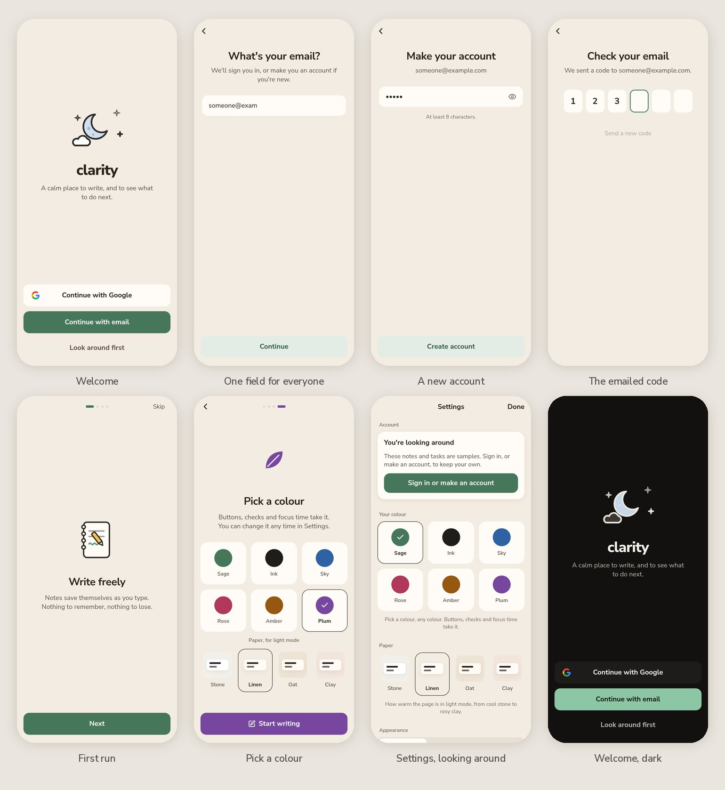

# Clarity revamp 5: "Sage"

A redesign of Clarity guided by **Rosebud** (the AI journal), taken as a design language rather than a feature list. It's a separate Expo Go app, built on revamp 4's code (features, store and motion) and redrawn. Since 2026-10-05 it has real accounts (see Accounts below). The notes and tasks are still samples until real data is wired in, following `docs/backend-plan.md`.

- **Open it on your phone:** in Expo Go, scan `docs/expo-go-qr.png` or enter `exp://sheets-winning-suspected-promise.trycloudflare.com`. The address changes whenever the tunnel restarts.
- **Where it lives:** `/root/projects/clarity-revamp-5` is the running copy. It's committed on the clarity repo's `revamp-5` branch, under `prototypes/revamp-5`. Nothing has been ported into the main app.
- **The one-page version** of this document, with live specimens, is `docs/design.html`. Rebuild it with `node docs/build-presentation.mjs`.

## After the first look on a phone (2026-10-05)

Four notes from the user, and what changed:

1. **"The top (above Today) feels off."** The month title, the week and a separate "Today Monday 5 October" line said the same thing three times, with loose spacing and large numbers; in dark mode the chosen day's disc nearly vanished. Now the top is one compact head: "**Today** ⌄" with "Monday 5 October" small under it (tap it for the calendar), then a quieter week with smaller numbers and a thin ink ring around the chosen day. The separate heading line is gone, and the content starts about 60 points higher.
2. **"In light mode tasks don't feel emphasised enough."** Task titles are now SemiBold. Task cards are the brightest surface, with a warm, slightly deeper lift. Today's two cards step back: they're shorter, sit on a quieter tint, and have no lift, so the tasks lead the page.
3. **"The area colours overwhelm the design."** Areas have no colour anywhere now. An area is a grey word in a task's line, a small tag on a note, and a plain chip in the filters. The only colours left are your accent and terracotta for late things.
4. **"Explore warmer tones for light mode."** There's a new **Paper** setting with four light pages: Stone (the first, cooler grey), **Linen** (the new default, a warm cream), Oat (a deeper beige) and Clay (rosy). Each has its own warm white for cards and inks tinted to match, and every text colour still reads at 4.5:1 or better. Switch between them in Settings to compare on the phone.

## Accounts (2026-10-05)

Phases 0 and 1 of `docs/backend-plan.md`. The main app's sign-in, offline and data code now sits in `src/core/`, copied unchanged from commit 44abd69 (`src/core/SOURCE.md` lists each file). Around it are Sage's own screens.

- **Welcome:** adapted from Rosebud's welcome page. The hour's picture sits over the name, with one line of promise. At the foot:
  - Continue with Google, as a white card with Google's G;
  - Continue with email, in your colour;
  - Look around first, which opens the sample notes with no account.
- **One field for everyone:**
  - The email step asks Clerk whether the address has an account. A known one goes on to its password, or to an emailed code if the account was made with Google. A new one goes on to making an account. Nobody has to choose between "sign in" and "sign up".
  - Each step is its own pushed page, so Back goes one step back.
- **The code:** six boxes, with the next one ringed in your colour. iOS offers the code from Mail. The sixth digit sends it; a wrong code shakes the row once and clears it, and a right one folds the boxes into a check that pops.
- **Ways round a password:** "Forgot password?" emails a code and leads to a new password, with other phones signed out. "Email me a code instead" signs in without the password, where the account allows it. The main app has neither.
- **First run:** three pages (write freely, gentle help, yours alone), then your colour and paper, using Rosebud's tiles. The leaf, the progress pill and the button take the chosen colour at once. Skip or "Start writing" ends it for good on this phone, and Back goes a page back.
- **Settings → Account:**
  - your email;
  - Export my notes (a file to share);
  - Learn from my writing, with Forget what it has learned;
  - Sign out, which warns if changes haven't reached the server (the main app drops them silently);
  - Delete account, asked twice in place.
  - Looking around without an account, a card says so and leads to signing in.
- **Doors, not redirects:** three guarded groups (signed out, first run, the app) swap as the session changes, so Back can never return through one.
  - The navigator mounts only once the session is known, so a link the app was opened with isn't lost.
  - The launch veil covers the wait and only ever shows at launch.
- **Kept on the phone:** your colour, paper, appearance, focus defaults, demo mode and whether first run has been seen now live in `src/state/device.ts`, saved with AsyncStorage. Before, they reset on every reload.
- **Errors in sentences:** Clerk's codes become plain words ("That code didn't match. Check the email and try again."), said under the field they belong to.

**Your own data (phase 3, 2026-10-06):**
- Signed in, every screen shows your account's notes, tasks and areas, in exactly the same design. Looking around, only the samples.
- **While loading:** placeholders the shape of the cards breathe in their place, so nothing jumps when the cards arrive. An empty list still shows its picture, but only once the list has really arrived.
- **If the lists can't be fetched** and nothing is kept on the phone, a calm card says so with Try again. Pull down to refresh on Today, Notes and Life Center.
- **An account's first task:** every task lives in an area, so with none yet, quick add says so and shows a "Name your first area" field. It doesn't take the keyboard from the task. A name typed there counts when you tap Add task, with no Return needed.
- **Every account saves** since 2026-10-06. Before that, only test accounts did. The read-only path is still there, should saving ever need pausing: a change says "Read-only for now: nothing changed" in the capsule, no screen claims "Saved" after it, and a new note or task doesn't open at all, so nothing typed is lost.

**Offline (phase 4, 2026-10-06), said quietly and never counted:**
- **Going offline:** the capsule says "Offline. Changes will sync." Changes keep showing at once.
- **Anything not yet sent** carries a small cloud: a task row by its details, a note card by its time. A note or task page says "Saved on this phone".
- **Back online:** once the last change is through, the capsule says "All changes saved". If nothing was waiting, it says nothing.

Signing up on the **web build** shows Cloudflare's "Verify you are human" check, which Clerk requires there. It never appears in the phone app.

## The editor (2026-10-06)

- **Rich notes:** the main app's Tiptap editor, with its page built into the app (`editor/`, `src/editor/`), drawn in Sage. Nunito Sans, the body at 17/27, and questions as quotes in the accent at the question size. Checklist rows tick with Sage's round check, which gives a little pop with a haptic as the line through the words fades in, and links take the accent. A new question comes down into place with a small rise as the page glides to it, and a newer copy of the note cross-fades in.
- **Writing:** the tools ride on the keyboard in a row that scrolls sideways. It holds every tool the main app has (checklist, bullets, numbers, indent, outdent, bold, italic, strike, heading, quote, link), then Next question on a question page, then the keyboard away. Each tool shows when it's on with the accent's soft fill. The row rises with the keyboard on the keyboard's own curve, fading in as it comes, and goes down with it.
- **Reading:** Go deeper sits above Tasks and Done (on a new note too, once it has words), and the menu by the title archives, or deletes after asking in place. The menu floats with the one shadow, fades as it closes, and a tap outside closes it.
- **Opening (2026-10-06):** the title and Go deeper are there from the first frame; three quiet lines stand where the words will be, and the words fade in over them, in Nunito Sans from the start, without moving. Before, the title filled in late, the words rose 8 points, and Go deeper popped in under them, which read as a jolt. The editor starts as the page opens, while the note is read, and the three lines breathe until the words come.
- **Today's question:** the page opens with the question as a quote and the cursor under it. Before anything's written, it can be swapped for another or taken away. Once there are words, those two fade but keep their place, so the line being written doesn't jump.
- **If the editor can't start:** the note is shown to read, as Sage drew it before, with Try again.
- **Quiet saving:** the note page says nothing about saving or syncing.
- **The keyboard (UX phase 3, 2026-10-06):** Go deeper, Tasks and Done are always there under the words. The keyboard covers them as they fade, and they fade back as it goes, while the tools ride it. The words end above whichever is higher, so they never jump, and nothing waits for the keyboard to finish. A new page opens straight to writing: its buttons wait under the keyboard until it first goes down.

## Moving between places (2026-10-06)

- **The new page fades in, on the page only.** A tap on a tab covers the old page in the page colour at once, and that veil lifts over 220 ms once the new page is drawn under it. Nothing slides, and the bar only changes which place is chosen. (Until the evening of 2026-10-06 the tab navigator did a fade-through itself. In expo-router 57 that left Life or Notes blank now and then, expo/expo#49681, so the navigator no longer animates.)
- **Every place is drawn ahead** once the app has a quiet moment, one at a time, so even a first visit opens at once.
- **Long lists draw as they scroll.** Notes builds only the cards on screen; Life draws each task as a slice of its section's card, and the slices still read as one card with its shadow and corners.
- **Choosing an area (2026-10-06, UX phase 2)**, the same on Life, Notes and Search:
  - The tap ticks, and the label inks.
  - One ink ring travels from chip to chip, stretching toward the new one and gathering as it lands, like the week strip's. A chip near the edge scrolls fully into view.
  - The list, as one layer, dips: it fades and lifts 3 pt over 110 ms. It changes out of sight and goes back to the top, then rises 8 pt into place over 220 ms.
  - The latest tap wins. Under Reduce Motion the ring fades across and the list cross-fades (80 ms out, 150 ms in).
  - Rows never animate on their own during a change; that was the lag.
  - Notes' chips unfold by moving the list down, not by jumping it. Search's results change the same way once typing pauses (120 ms), not on every key.
  - Done's little bump is kept for a task arriving, not for a filter showing more of them.
- **Another day** (phase 2): the old day leaves toward the far side, quicker than the new one arrives. The title cross-fades and the "‹ Today" pill fades. A swiped week carries on out and the next comes in from that side. A new time of day cross-fades Today's card.
- **Loading** (phase 2): placeholders fade as the content arrives (it rises in on Notes and Life), and the "couldn't load" note comes and goes softly.

## Repeats and reminders (2026-10-06)

- **Separate rows, separate sheets.** Repeats: Never, every day, weekday, week or month; ticked off, the task comes back on its next day. Reminder: when, counted back from the task's time.
- **On a repeating task, the reminder sheet asks "Every time" or "Just this time".** The row then reads, for example, "At the time, this time". Ticked off, the task comes back without a reminder that was for this time only.
- **"No reminder" takes the reminder only;** "Don't repeat" takes the repeat only.

## AI help (2026-10-06)

- **Asked once, plainly.** The opening screens' second page, "Gentle help", says what AI help does and that what it reads goes to AI companies that don't keep it or train on it: Not now, or Turn on AI help. Skip the opening screens and the same page comes on its own once. Settings has an "AI help" switch; "Learn from my writing" only shows while it's on.
- **Off means nothing is sent.** Sage's own questions, summary and first steps stand in, and a note's tasks say Find tasks needs AI help, with the way to Settings.
- **Word help (made dependable 2026-10-07, after the user's phone test):** after a short pause in writing, a quiet strip above the tools, lying over the bottom of the words (the line being written is kept clear of it, so nothing moves when it comes or goes). Mid-sentence it has two rows: up to three ways to finish the sentence (they start with "…") over up to three ways to start the next, one per mood, in the row nearest the tools, so those are always in sight. After a full stop, only the starts.
  - **It holds.** As the writer types on, what still fits stays: typing the first letters of an idea keeps it (and a tap then puts in only the rest), and the others fade as they stop fitting. New words come at the next pause, not with every key, and words that arrive mid-flow wait until the writer rests.
  - **A pick leaves it up.** The chosen chip goes, the rest stay while they fit, three soft dots say more are coming, and new words for where the cursor now is come at once. The editor page fits the words against what's really typed, so a word begun just before the tap isn't put in twice.
  - **When it asks:** after 0.8 s of stillness, once a few new characters are written and what's shown no longer fits; at most every 3 s; at once after a pick. It asks for words only ("words" mode, about half the AI's time), and for the AI's questions now and then in the background.
- **The AI's questions:** Next question on a question page, and Go deeper, use the AI's questions about what was just written. Go deeper on a note opened to read starts with Sage's own; "another question" then asks the AI about the note, the card reading with three dots at its usual size until it comes.
- **On its own, quietly:** Find tasks the first time a note's tasks open; "How it's going" on a task; first steps in Focus; an untitled note is given a title as it's left.
- **Failures are quiet.** Word help and questions simply don't come; How it's going and first steps fall back to Sage's own. Only Find tasks, which was asked for, says it couldn't read the note.

## The brief

The user asked for:

- a redesign of Clarity with Rosebud as the main guide;
- simplicity and delight in interactions;
- no unnecessary counts (of notes, tasks and so on);
- an interface that is readable yet warm;
- modern micro-interactions and animations, made from scratch where needed;
- icons instead of text where they ease the load;
- a separate Expo Go app called revamp-5, with the main app untouched.

Two answers to questions on 2026-10-05 settled the direction:

- **Copy the design elements and structure adapted to Clarity**, not Rosebud's full structure or specific elements. Clarity keeps its own features: notes, tasks, focus, Catch up and Life Center.
- **Sage is the accent, with a picker**, as Rosebud lets people choose their colour.

## What Rosebud does well

All 47 of Rosebud's screens and its two-minute onboarding video were studied on Appllama (references: `clarity-design-research/revamp-5/rosebud/refs.md`). What makes it work:

1. **A grey page with white cards.** Content sits on cards; everything else (headings, the week, controls) sits quietly on the page. Nothing has a border.
2. **Small, calm type in one family.** Titles are bold, never big. Section names are small, grey, centred and in sentence case.
3. **One accent, chosen by the person.** The accent is spent on the primary button, the + button, ticked checks and toggles. Disabled buttons are a pale tint of the accent, not grey.
4. **Structure, repeated.** Each screen is a centred title, then cards, then a pair of equal buttons under a card, then the next centred heading.
5. **Things change in place.** "Add goal" turns into a check, "Finish entry" splits into "Back / Confirm", and Confirm becomes a spinner. A reflection arrives after three dots and writes itself in.
6. **Small flat pictures, only at moments.** A sun, a moon, a sprout and a party popper, drawn as flat colour inside a dark outline, appear at the start of the day and the end of a flow, never as decoration.

## How it maps onto Clarity

| Rosebud | Clarity, revamp 5 |
|---|---|
| Grey page, white cards | Warm grey page `#F2F0EB`; tasks, notes and settings on white cards |
| Month over a week strip; "Today July 23" | One compact head: "**Today** ⌄" over "Monday 5 October", then the week. The name opens the calendar. |
| Morning Intention and Evening Reflection cards | **Today's two ways in:** writing to the day's question and focusing on what's next, each with its own small moving picture |
| A card with checks on the right | Tasks on a card, Rosebud's check under the thumb |
| Add goal / Manage under the list | **Add task / Catch up** (or All tasks) |
| Completed goals, filled checks | A folded **Done** under the tasks; it gives a small bump when a task lands in it |
| History of entry cards | **Notes**: a card per note under day headings, which line up with the words in the cards |
| The composer's chip, question and buttons | **The note page**: area chip, small-capital date, the question in the accent, then Done and **Next question** |
| Entry reflection | **How it's going** on a task: three dots, then the summary writes itself in word by word |
| Goal suggestions, "+ Add goal" turning into a check | **Find tasks**: a card per task found in a note, with **Not now / + Add**; Add turns into a check |
| Edit goal: field, "why", one settings card | **Task page**: the task in a white field with its check, the details, one card of Area / Day / Time / Reminder / Repeats |
| Choose your theme, six tiles | **Your colour** in Settings: Sage, Ink, Sky, Rose, Amber, Plum |
| Settings sheet with Done | Settings is a sheet with Done, grey captions and white groups |
| Five places, round + in the middle | **Today, Notes, +, Life, Search**. The + opens a small dial with **Note** and **Task**. |
| "First entry complete!" | **All caught up**: a sprout grows, then one button |
| Finish entry's in-place confirm | **Delete task** and **Reset sample data** ask in place: the button splits into Keep and Delete |

**Not taken:** the morning and evening rituals themselves, goals, weekly series, streaks and the streak calendar, insights built on word and entry counts, coachmarks, the paywall, onboarding questions, and emoji as icons.

**Added for Clarity:** a Search tab gives the bar its fourth place and gathers notes and tasks in one search; search used to live inside Notes.

## Principles

1. **Content on cards, chrome on the page.** If you wrote it, it sits on a white card. Headings, the week and the controls stay on the page. The day's tasks are the brightest card on Today.
2. **Quiet centred names, no counts.** Sections label what follows and never count it, and nothing measures your notes, tasks or words. Progress is a line that fills; Catch up shows one card peeking from behind, never a number.
3. **One accent, yours, and no other colour.** Sage unless you pick another. It goes on the primary action, a ticked check, the +, toggles and focus time. Areas are words, not colours.
4. **Buttons answer in place.** A label rolls to the next one; a spinner or a check grows where the words were; a confirmation splits a button in two. No alert asks "are you sure?" about small things.
5. **An icon before a word.** The bar, the task meta line, the note tools and the time-of-day setting are icons. Words stay where an icon could be misread.
6. **Pictures for moments.** Six small hand-drawn scenes appear where a moment deserves one (the day's question, focus, a clear list, an empty search), and each has one quiet motion.

## Colour

A warm page, warm white cards, warm ink, and one accent. Every text colour reads at 4.5:1 or better on page, card and well in both themes (checked with `/tmp/clarity-revamp-5/contrast.py`).

**Paper** (light mode, chosen in Settings):

| Paper | page | card | quiet (Today's cards) | ink / ink2 / ink3 |
|---|---|---|---|---|
| Stone | `#F2F0EB` | `#FFFFFF` | `#F8F6F2` | `#1F1D1A` / `#57524B` / `#6F6A62` |
| **Linen** (default) | `#F3ECE2` | `#FFFCF7` | `#FAF5EE` | `#2A231C` / `#5C5146` / `#74685B` |
| Oat | `#EEE4D5` | `#FFFAF2` | `#F7F0E5` | `#2B2219` / `#5D5043` / `#716352` |
| Clay | `#F1E5DC` | `#FFFAF6` | `#F9F1EB` | `#2C211C` / `#62524A` / `#706258` |

Dark mode has one page:

| Token | Dark | Use |
|---|---|---|
| page | `#121110` | The canvas |
| card | `#1E1C1A` | Tasks, notes, settings |
| quiet | `#191816` | Today's two cards |
| sunken | `#292724` | A pressed row, a well inside a card |
| ink / ink2 / ink3 | `#F2EFE9` / `#BCB6AC` / `#959087` | Words, second lines, meta |
| line | `#3A3733` | Outlines, the bar's top edge |
| warm | `#F0956C` | Late and slipped (light: `#B4532A`) |

**Your colour.** Each accent has a solid (buttons, checks, +), a soft tint (selected and waiting states), its text form, and a deep shade for focus time:

| Accent | Light solid | Dark solid | Deep (focus) |
|---|---|---|---|
| Sage (default) | `#47775B` (white text 5.2:1) | `#8DC6A5` | `#1F3B2C` |
| Ink | `#1F1D1A` | `#F2EFE9` | `#1F1D1A` |
| Sky | `#2E62A3` | `#90B8EF` | `#1B3150` |
| Rose | `#B0385A` | `#F29CB4` | `#47192A` |
| Amber | `#965811` | `#EAB56C` | `#45290B` |
| Plum | `#77479F` | `#CAA8EB` | `#301C47` |

**Life areas have no colour.** They were small dots at first; on the phone even those overwhelmed the page, so an area is now a grey word.

## Type

One family, **Nunito Sans**: a warm, rounded geometric sans close to Rosebud's and the face Clarity's own app already uses. Weight carries emphasis; there's no second family.

| Style | Size / line | Weight | Use |
|---|---|---|---|
| title1 | 26 / 32 | Bold | Note and focus titles |
| title2 | 21 / 27 | Bold | Sheet titles, the task field |
| headline | 17 / 22 | Bold | Top bar names, buttons, card titles |
| row | 17 / 23 | SemiBold for an open task, Regular once done | Task titles |
| body | 17 / 27 | Regular | Writing |
| prompt | 18 / 25 | SemiBold | A question, in the accent |
| section | 15 / 20 | SemiBold | Centred section names, grey |
| subhead | 15 / 20 | Regular | Excerpts, second lines |
| footnote | 13 / 18 | Regular | Meta |
| eyebrow | 12 / 16 | Bold caps | The note's date line, "New task" |
| numerals | 104 / 108 | ExtraBold | Focus minutes, nowhere else |

## Shape and space

- **Corners:** cards 18, buttons 14, sheets 28, wells 12; chips, capsules and the + are round. Corners are continuous.
- **Space:** a 4-point grid. Cards sit 16 from the screen edges, words 16 inside a card. The space between sections is 28.
- **Elevation:** cards have only the faintest lift; things that float (the + dial, menus, the capsule) have the one shadow.

## Components

- **Card / CardGroup / CardRow.** A pressable card squashes to 0.97 and springs back; rows inside a card wash with the well colour instead of squashing.
- **SectionTitle.** Grey words, centred, or on the left in line with the cards' words (Notes' day headings); with a link it gets a small chevron ("Coming up ›").
- **Button.** Primary, secondary, outline, soft, plain, danger. States are idle, busy (a turning arc) and done (a check that pops). Labels roll when they change.
- **ButtonPair.** Rosebud's two equal halves under a card.
- **CircleCheck.** Open, it's a ring with a faint check, which reads as "tap to finish". Ticked, the accent fills it from the middle, a white check draws itself, the circle pops and a soft halo leaves it.
- **TaskRow.** Words and an icon meta line on the left, the check on the right. Swipe right to finish, left to focus; tap to open; long-press for the quick menu.
- **NoteCard.** A small line (area, time), the bold title and two or three lines of the note.
- **TopBar.** A small centred name with icons at either side. It stays put; a hairline draws once content scrolls under it.
- **TabBar.** A flat bar with four places and the round + raised a little in the middle. The chosen tab is ink and filled, and gives a small pop.
- **WeekStrip.** Small weekday letters over the dates, today's in the accent, the chosen day in a thin ink ring that stretches as it moves.
- **Capsule.** "Saved", "Moved to Tomorrow": an ink capsule with the accent's check opens at the top and gathers itself away.

## Motion

Revamp 2's and revamp 4's motion, which the user liked, kept and re-tuned for cards, plus new pieces where Rosebud's flows needed them.

**Tokens** (`src/theme/motion.ts`): press 90 ms, quick 160, base 220, enter 300, roll 280, morph 260, flood 600. One ease-out curve, `bezier(0.16, 1, 0.3, 1)`. Springs: pop (420 ms, 0.58), glide (460, 0.78), lead and trail (320/0.82 and 540/0.86, the stretching pill), settle (380, 1), bloom (420, 0.7). Under Reduce Motion, springs land without overshoot, travel becomes a fade and loops stop.

**Reduce Motion, and the presets (2026-10-06, branch revamp-5-ux).**
- When Reduce Motion is on, Reanimated snaps every animation, and Sage never overrode that. So the fades meant to stand in for travel snapped too, and Hold to stop became a tap.
- Now fades, colour and progress, presses and the timings that do a job all carry `keep` (`fadeTiming` for timings) and play either way. Those timings are Hold to stop's fill and the focus timer. (The note page's room for the keyboard now follows the keyboard itself.)
- Travel keeps the default and snaps. Where something both moves and fades, Sage plays only the fade.
- Shared presets replace the one-off builders: `arrive` (fade, base, ease-out), `arriveSlow` (enter), `leave` (quick), `settle` (layout), `riseIn` (`rise`, a fade under Reduce Motion) and `arriveAfter` (a delay).
- Presses squash to `squash` (0.97), or `squashSmall` (0.9) for small round targets.
- A choice never changes a label's weight or width: chips, segmented controls, swatches, outcomes, sheet rows, search matches and ticked titles all keep one face.
- The capsule shows over sheets and Settings, rolls its words when something new is said, and VoiceOver hears it.

**Kept from revamp 2 and 4:**

- the press squash and spring-back;
- the stretching pill, now the week's disc, which stretches into a capsule as it travels and gathers back into a disc;
- the check's pop and the line drawn through a finished task, one line at a time;
- the two-way swipe;
- rolling words and numbers;
- the capsule that opens to fit its words;
- Catch up's dealt cards, which leave in the direction of the choice;
- focus time's flood and draining level, now in a deep shade of your colour;
- hold-to-stop.

**New in revamp 5:**

| Moment | What moves |
|---|---|
| The + dial | The + turns into ×, the page dims, and Note and Task spring out of the + in a little arc |
| Ticking a task | The check fills from the middle and pops, a halo leaves it, a line draws through the words; after a beat the row leaves, the rows below close the gap, and Done gives a small bump |
| Changing day | The week's ring stretches to the new day; the page slides in from that side; swiping the strip slides in the next week |
| Today's page written | The card sinks into the page (white turns to page grey with an outline), the picture dims, and a check pops in |
| Writing to questions | "Next question" brings a new question down under your answer; "another question" rolls the words |
| Done on a note | The button turns into a check, the page closes, and "Saved" opens at the top of Today |
| How it's going | Three dots rise and fall, then the summary writes itself in word by word and the steps fade up |
| Find tasks | Three dots while reading; "+ Add" turns into a check that pops where the word was |
| Your colour | The chosen disc pops, draws a check and sends out a ring; the whole app takes the colour |
| Catch up | The card behind steps back while the top one is sorted, then peeks out again |
| Launch | A leaf in your colour grows in with a small turn, the name settles under it, and the page lifts away |

## The pictures

These are drawn for Clarity in Rosebud's manner: flat colour inside a dark outline, which turns light in dark mode. Each is SVG with Reanimated, and each has one quiet motion.

- **The day** (Today's question card): at dawn the sun rises behind the horizon and its rays breathe; by day it turns slowly behind a drifting cloud; at dusk it sets over water while two birds cross; at night a crescent moon rocks and three stars twinkle.
- **Hourglass** (focus): the sand runs, and when it's out the glass turns over.
- **Sprout** (a clear list, All caught up): the stem draws up out of the soil, two leaves unfurl, sparkles appear, then it sways.
- **Tea** (nothing planned, the break): steam rises in three slow wisps.
- **Magnifier** (search, before typing): it drifts over a page.
- **Notebook** (no notes): a pencil keeps writing the same small line.

## Screens

- **Today:** one compact head ("Today", the date, the week) fixed at the top; the two ways in (today only, on a quieter surface); Tasks on the brightest card with Add task and Catch up; Done folded; Notes as cards; Coming up.
- **Notes:** a card per note under day headings that sit on the left, in line with the words in the cards; the area filter is behind one icon.
- **Life Center:** area chips under the bar; a single card when something slipped ("A few things slipped", then Catch up); Today, This week, Later and Someday as task cards; Done with Clear.
- **Search:** a white field under the bar and area chips; results as note cards and a task card, with your words picked out in the accent.
- **Note:** a white page with the area chip, the date line, the title and the words. Checklists can be ticked. "Go deeper" offers a question that can join the note. The tools sit above the keyboard; under them are Tasks and Done.
- **New note from Today's card:** the question in the accent, your answer, and Next question; Done saves it as today's page.
- **Task:** the task with its check, details, the settings card, "Where you left off", Start focus, How it's going, its notes, and Delete asked in place.
- **Quick add:** "New task", one line, the area and day chips (words like "tomorrow at 3pm" are read as you type), and Add, which stays pale until there's something to add.
- **Catch up:** a fixed queue, one card at a time with one peeking behind; Do it today; Tomorrow, Weekend or Next week; Let it go or Skip; the sprout at the end.
- **Focus:** the hourglass and the task; Rosebud-style tiles for the length; the first step; Start. Then the flood and the level, a check-in with outcome tiles, and a break in the dark with tea.
- **Settings:** Your colour, Appearance, Larger text, focus defaults, and prototype controls (time of day as icons, faster timers, reset asked in place).

## Navigation

| Screen | How it appears | Back |
|---|---|---|
| Today, Notes, Life, Search | Tabs, no slide | Tapping the current tab returns to the top (Today also comes back to today) |
| Note, Task | Pushed | Chevron and the edge swipe |
| Settings | A sheet with Done | Drag down or Done |
| A note's tasks | A sheet with two heights, over the note | Drag down |
| Quick add | Floats over the page | Tap outside |
| Catch up | Full screen with its own close | Close |
| Focus | Full screen, fades in; only stopping ends a session | Hold to stop |
| Date, time, area, reminder, link | Native sheets sized to what's in them | Drag down |
| Welcome and the sign-in steps | Their own door; each step pushed | Back goes a step; once signed in, the door is gone |
| First run | Its own door, faded in | Back goes a page; Skip or Start writing ends it |

## How it was checked

- **Types:** `npx tsc --noEmit` passes in strict mode.
- **Screenshots** in light and dark at iPhone size, from Metro's web build (`/tmp/clarity-revamp-5/shots.js`).
- **Interactions:** `/tmp/clarity-revamp-5/interact.js` runs 26 scripted checks, and all 26 pass. They cover:
  - the + dial;
  - ticking a task into Done;
  - another day from the week;
  - writing to two questions, Done, and the "Saved" capsule;
  - the written card;
  - the streamed summary, dots first;
  - Find tasks' Add turning into a check;
  - switching to Rose;
  - focus starting;
  - Catch up dealing the next card;
  - a right swipe finishing a task;
  - the long-press menu;
  - a scan of Today, Notes, Life Center, Search, a note and a task for counts like "3 tasks" or "(4)", which found none.
- **Accounts, in the web build:**
  - the welcome, every sign-in step and first run, in light and dark;
  - "Look around first" opening the sample notes, and Settings saying so;
  - an unknown address leading to "Make your account";
  - a wrong code shaking and clearing;
  - a link straight to Settings surviving a reload;
  - the iPhone bundle compiling.

  Signing up stops at Cloudflare's check, as it should, so the full sign-up and sign-in round trip waits for the phone.
- **Not yet seen on a phone:**
  - the entering animations the web build skips (the launch leaf, the "Saved" capsule's arrival);
  - the strike drawn line by line, which needs iOS text measurement;
  - haptics;
  - SF Symbols' filled tab icons;
  - feel at 60 fps.

## If it's chosen

Port in this order: tokens and the accent picker, then Nunito Sans and the type ramp, then remove counts, then the card components and the check, then motion, then the screens. The pictures can come last, as they stand alone.
